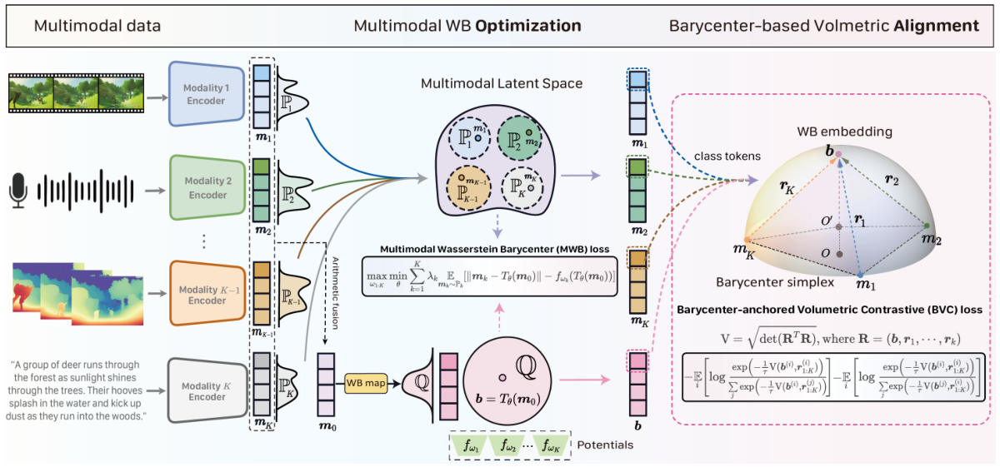
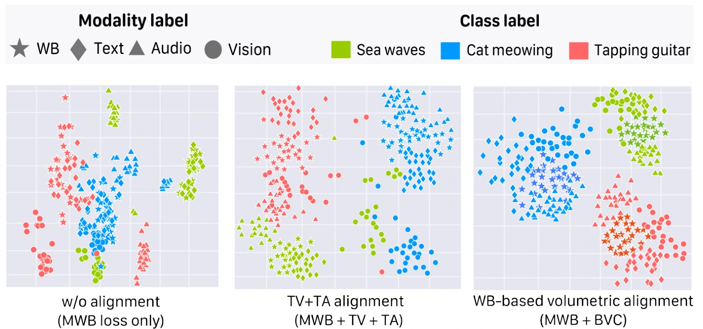

<div align="center">

###  Binding Multiple Modalities via Multimodal Wasserstein Barycenter

**NeurIPS 2026 · Oral Presentation**

Xiaole Tang (<a href="mailto:Sherlock315@163.com">Sherlock315@163.com</a>) · Jiayi Xu · Xiang Gu · Yan Yang · Jian Sun

Xi’an Jiaotong University  


<a href="assets/paper.pdf"></a>
<a href="https://github.com/xl-tang3/barybind"></a>
<a href="#citation"></a>

**Learn the Wasserstein barycenter of multimodal distributions and bind modalities around it.**

</div>

<!-- Add the verified project-page URL here after deployment. Replace assets/paper.pdf with the final paper URL when available. -->

BaryBind is a multimodal alignment framework that learns a **Multimodal Wasserstein Barycenter (MWB)** as a shared anchor, then aligns modalities via **barycenter-anchored volumetric contrast**. Rather than fixing a modality-specific reference, it optimizes the anchor across modality distributions and captures their higher-order geometry.

<p align="center">
  
</p>
<p align="center"><sub>WB optimization learns the shared anchor; volumetric alignment binds modalities around it. Figure 3 from the paper.</sub></p>

<p align="center">
  <a href="#method">Method</a> ·
  <a href="#results">Results</a> ·
  <a href="#installation">Installation</a> ·
  <a href="#pretrained-encoders">Pretrained Encoders</a> ·
  <a href="#model-zoo">Model Zoo</a> ·
  <a href="#data-preparation">Data</a> ·
  <a href="#training">Training</a> ·
  <a href="#evaluation">Evaluation</a> ·
  <a href="#citation">Citation</a>
</p>

## Highlights

- **A learned shared anchor.** Optimize a Wasserstein barycenter across modality distributions to approximate their geometric semantic center.
- **Higher-order alignment.** Construct a barycenter simplex from the WB embedding and modality-to-WB gaps, and contrast its volume across matched and mismatched samples.
- **Scaling Beyond three modalities.** Extend alignment to text, video, audio, subtitles, and depth.
- **Understanding and generation.** Evaluate cross-modal retrieval, multimodal classification, VideoQA, and text/audio-conditioned image generation, including missing-modality settings.

## Method

BaryBind connects distribution-level alignment with sample-level multimodal geometry in three steps.

| Stage | Operation | Role |
| :--- | :--- | :--- |
| **01 · WB optimization** | Learn the WB map $T_\theta$ using all modality distributions | Establish a shared geometric anchor |
| **02 · Simplex construction** | Form the WB embedding $b$ and gaps $r_k=b-m_k$ | Represent barycenter-relative, higher-order geometry |
| **03 · Volumetric alignment** | Contrast barycenter simplex volumes | Bind matched multimodal samples around the WB |

The MWB objective is

$$
\mathcal{L}_{\mathrm{MWB}}^*
= \inf_{Q\in\mathcal{P}(\mathcal{M}_B)}
\sum_{k=1}^{K}\lambda_k W(P_k,Q),
\qquad \lambda_k\geq 0,\quad \sum_{k=1}^{K}\lambda_k=1.
$$

Here, $P_k$ is the distribution of k-modality features and $Q$ is the WB distribution. The learned map produces $b=T_\theta(m_0)$ from an initializer $m_0$, while its optimization uses all modalities.

With $R=[b,r_1,\ldots,r_K]$, the paper defines the squared barycenter simplex volume as

```math
\mathrm{Vol}^2(\boldsymbol b,\boldsymbol r_{1:K})
=\det(\mathbf R^\top\mathbf R)
=\det\!\begin{pmatrix}
\langle\boldsymbol b,\boldsymbol b\rangle & \langle\boldsymbol b,\boldsymbol r_1\rangle & \cdots & \langle\boldsymbol b,\boldsymbol r_K\rangle \\
\langle\boldsymbol r_1,\boldsymbol b\rangle & \langle\boldsymbol r_1,\boldsymbol r_1\rangle & \cdots & \langle\boldsymbol r_1,\boldsymbol r_K\rangle \\
\vdots & \vdots & \ddots & \vdots \\
\langle\boldsymbol r_K,\boldsymbol b\rangle & \langle\boldsymbol r_K,\boldsymbol r_1\rangle & \cdots & \langle\boldsymbol r_K,\boldsymbol r_K\rangle
\end{pmatrix}
=\det\!\begin{pmatrix}
\|\boldsymbol b\|^2 & \boldsymbol b^\top\mathbf G \\
\mathbf G^\top\boldsymbol b & \mathbf G^\top\mathbf G
\end{pmatrix}
```
where $\mathbf G=[\boldsymbol b,\boldsymbol r_1,\ldots,\boldsymbol r_K\,]$
			collects the modality-to-WB gaps;
			$\boldsymbol b^\top\mathbf G$	captures barycenter-relative geometry,
			while $\mathbf G^\top\mathbf G$	encodes gap magnitudes and inter-modality correlations. 

The **Barycenter-Anchored Volumetric Contrastive (BVC)** loss contrasts matched WB–gap pairs against mismatched ones. **Data-Anchor Matching (DAM)** further supervises whether the anchor and multimodal features match. The combined objective is

$$
\mathcal{L}=\mathcal{L}_{\mathrm{MWB}}
+\alpha_1\mathcal{L}_{\mathrm{BVC}}
+\alpha_2\mathcal{L}_{\mathrm{DAM}}.
$$


<p align="center">
  
</p>
<p align="center"><sub>Multimodal embeddings group around WB anchors while retaining class separation. Original experimental visualization, Figure 4.</sub></p>

## Results

Selected results from the paper. Higher is better for retrieval and classification; lower is better for FID. **T / V / A / S / D** denote text, video, audio, subtitle, and depth, respectively.

### Zero-shot bidirectional retrieval

**Recall@1 (%) · T-VA configuration · Table 2.** Each cell reports **T2V / V2T**.

| Method | MSR-VTT | DiDeMo | ActivityNet | VATEX |
| :--- | :---: | :---: | :---: | :---: |
| VAST | 49.3 / 43.7 | 49.5 / 48.2 | 51.4 / 46.8 | 80.0 / 77.3 |
| Triangle | 54.8 / 51.9 | 54.6 / 52.2 | 59.6 / 54.4 | 84.0 / 80.1 |
| **BaryBind** | **56.1 / 53.6** | **56.3 / 54.0** | **60.6 / 57.2** | **84.7 / 81.8** |

Under the **five-modality T-VASD configuration**, BaryBind reaches **57.8 / 54.6** on MSR-VTT and **86.1 / 85.4** on VATEX (Table 2).

<details>
<summary><b>Classification and missing-modality inference</b></summary>

**VGGSound5K · Acc@1 / Acc@5 (%)**

| Setting | Input at inference | VAST | BaryBind | Source |
| :--- | :---: | :---: | :---: | :---: |
| Zero-shot classification | A | 40.3 / 71.7 | **45.7 / 75.2** | Table 1 |
| Zero-shot classification | V | 46.3 / 72.7 | **48.3 / 76.4** | Table 1 |
| Zero-shot classification | A+V | 48.1 / 79.6 | **55.6 / 83.4** | Table 1 |
| Missing video; trained with A+V | A | 40.8 / 71.6 | **49.4 / 78.3** | Table 4 |

The missing-video experiment uses a distinct training/inference setting from the audio-only entry in Table 1.

</details>


See the [paper](assets/paper.pdf) for complete comparisons, experimental protocols, and ablations.

## Installation

The reported code environment uses **Python 3.9** and **CUDA 11.7**, with PyTorch and additional dependencies specified in `preinstall.sh`.

```bash
git clone https://github.com/xl-tang3/barybind.git
cd barybind

conda create -n barybind python=3.9
conda activate barybind
sh preinstall.sh
```

Run the commands below from the repository root. Other environment versions may work, but compatibility has not been established here.

## Pretrained Encoders

Prepare the visual, audio, and text encoder checkpoints before training.

### 1. EVA-CLIP · visual encoder

```bash
mkdir -p pretrained_weights/clip

wget -P pretrained_weights/clip/ \
  https://huggingface.co/QuanSun/EVA-CLIP/resolve/main/EVA01_CLIP_g_14_psz14_s11B.pt
```

### 2. BEATs · audio encoder

Download `BEATs_iter3_plus_AS2M.pt` from the [official BEATs repository](https://github.com/microsoft/unilm/tree/master/beats) and place it in `pretrained_weights/beats/`.

```bash
mkdir -p pretrained_weights/beats
```

### 3. BERT · text encoder

Download and save both the model and tokenizer:

```python
from transformers import BertModel, BertTokenizer

save_dir = "pretrained_weights/bert/bert-base-uncased"

model = BertModel.from_pretrained("bert-base-uncased")
tokenizer = BertTokenizer.from_pretrained("bert-base-uncased")

model.save_pretrained(save_dir)
tokenizer.save_pretrained(save_dir)
```

Expected checkpoint locations:

| Encoder | Local path |
| :--- | :--- |
| EVA-CLIP | `pretrained_weights/clip/EVA01_CLIP_g_14_psz14_s11B.pt` |
| BEATs | `pretrained_weights/beats/BEATs_iter3_plus_AS2M.pt` |
| BERT | `pretrained_weights/bert/bert-base-uncased/` |

## Model Zoo

| Model directory | Modalities | Checkpoint |
| :--- | :--- | :--- |
| `barybind_pretrained_4modalities` | Text, video, audio, subtitle | Download link pending |

<!-- Maintainer: replace the pending entry with the actual checkpoint-folder URL. -->

When downloading a pretrained BaryBind model, retain the **entire model directory**, including both `log/` and `ckpt/`. For example:

- `pretrained_models/barybind_pretrained_4modalities/log/`
- `pretrained_models/barybind_pretrained_4modalities/ckpt/`

Pass the model directory containing these two folders to `--pretrain_dir`. This is distinct from `--checkpoint`, which points to an individual `.pt` file for evaluation.

## Data Preparation

BaryBind uses a **150K-sample subset of VAST-27M** for continued pretraining.

| Resource | Link |
| :--- | :--- |
| VAST-27M data preparation | [Official VAST repository](https://github.com/TXH-mercury/VAST) |
| 150K subset annotations | [Download annotations](https://drive.google.com/file/d/1s_YMQirx4MalnC_dw7h-NVY2KkTimCrC/view?usp=sharing) |

Save the subset annotation file as `annotations150k.json`. The annotation file does not replace the corresponding media; prepare those following VAST's instructions.

Update the annotation and local data paths in:

- `scripts/barybind/finetune_ret.sh`
- `config/barybind/finetune_cfg/finetune-area.json`

For downstream evaluation, configure the relevant dataset annotations and media paths in the selected task configuration.

## Training

### Continued pretraining on VAST-150K

After preparing the encoder weights, model initialization, and subset data, set the appropriate paths and configuration in the launch script, then run:

```bash
sh scripts/barybind/finetune_ret.sh
```

### Downstream fine-tuning

Select the downstream task configuration and update the checkpoint, dataset, and output paths in `scripts/barybind/finetune_ret.sh`, then run the same script:

```bash
sh scripts/barybind/finetune_ret.sh
```

For example, the following command fine-tunes a retrieval model with the MSR-VTT configuration. Set the paths before launching. The example uses **eight local GPU processes**; adjust the process count and training configuration for your hardware.

```bash
export PRETRAIN_DIR="/path/to/barybind_pretrained_4modalities"
export OUTPUT_DIR="/path/to/outputs/msrvtt"

python3 -m torch.distributed.launch \
  --nnodes 1 \
  --node_rank 0 \
  --nproc_per_node 8 \
  --master_port 9834 \
  ./run.py \
  --learning_rate 2e-5 \
  --checkpointing true \
  --first_eval true \
  --save_best true \
  --config ./config/barybind/finetune_cfg/retrieval-msrvtt.json \
  --pretrain_dir "$PRETRAIN_DIR" \
  --output_dir "$OUTPUT_DIR"
```

## Evaluation

Use the matching task configuration and specify the saved fine-tuned checkpoint. Add these arguments to the corresponding task command:

```bash
--mode testing \
--checkpoint /path/to/saved_checkpoint.pt
```

<details>
<summary><b>Complete MSR-VTT evaluation command</b></summary>

```bash
export PRETRAIN_DIR="/path/to/barybind_pretrained_4modalities"
export FINETUNED_CHECKPOINT="/path/to/saved_checkpoint.pt"
export EVAL_OUTPUT_DIR="/path/to/outputs/msrvtt-eval"

python3 -m torch.distributed.launch \
  --nnodes 1 \
  --node_rank 0 \
  --nproc_per_node 8 \
  --master_port 9834 \
  ./run.py \
  --config ./config/barybind/finetune_cfg/retrieval-msrvtt.json \
  --pretrain_dir "$PRETRAIN_DIR" \
  --output_dir "$EVAL_OUTPUT_DIR" \
  --mode testing \
  --checkpoint "$FINETUNED_CHECKPOINT"
```

</details>

## Citation

If you find BaryBind useful in your research, please cite:

```bibtex
@inproceedings{tang2026barybind,
  title     = {Binding Multiple Modalities via Multimodal Wasserstein Barycenter},
  author    = {Tang, Xiaole and Xu, Jiayi and Gu, Xiang and Yang, Yan and Sun, Jian},
  booktitle = {NeurIPS},
  year      = {2026}
}
```

## Acknowledgments

BaryBind builds on [VAST](https://github.com/TXH-mercury/VAST) and uses pretrained components from [EVA-CLIP](https://github.com/baaivision/EVA/tree/master/EVA-CLIP), [BEATs](https://github.com/microsoft/unilm/tree/master/beats), and BERT via [Hugging Face Transformers](https://github.com/huggingface/transformers). We thank the authors for making their research and code available.
